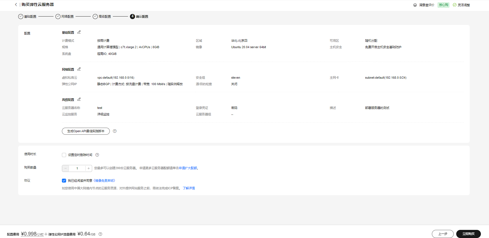
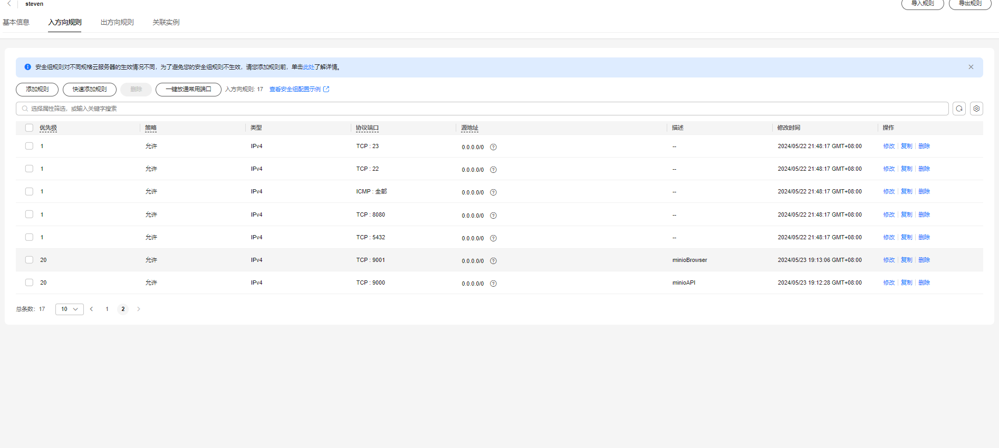
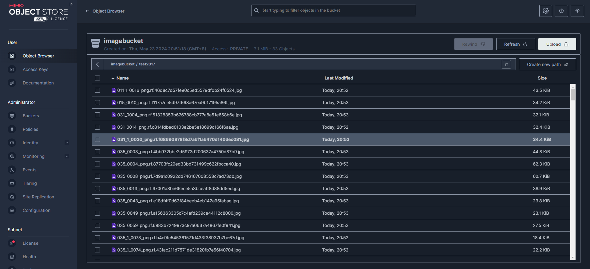
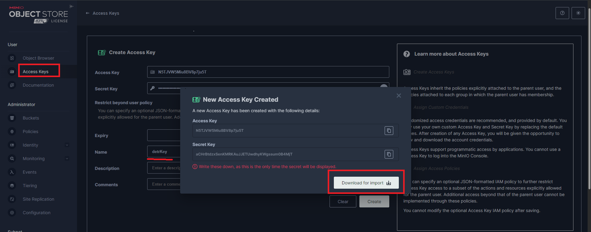
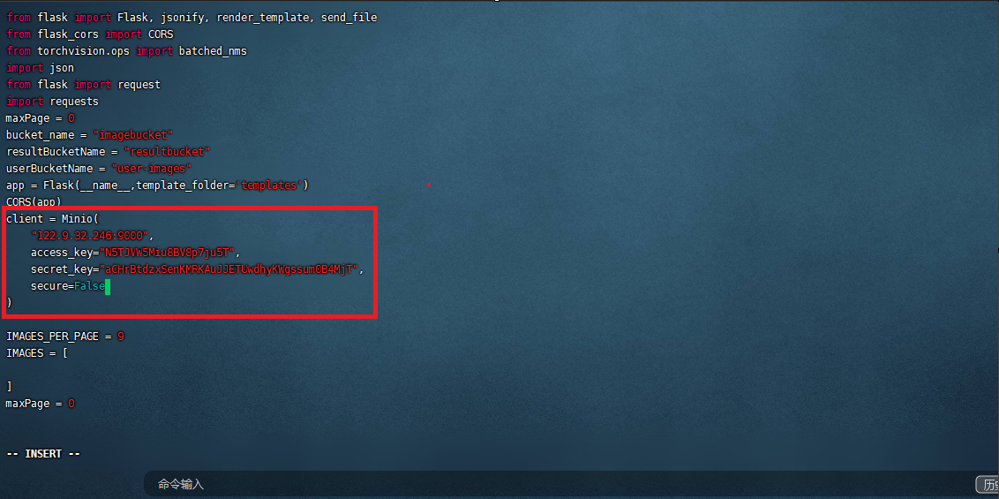
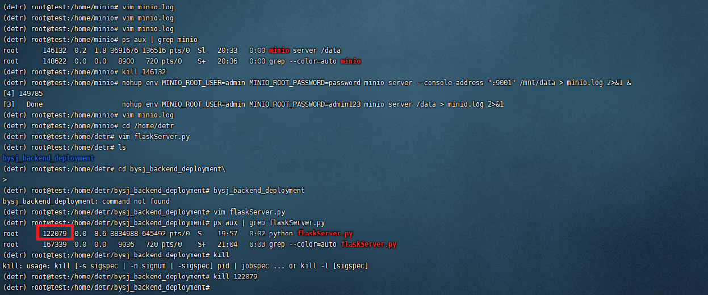
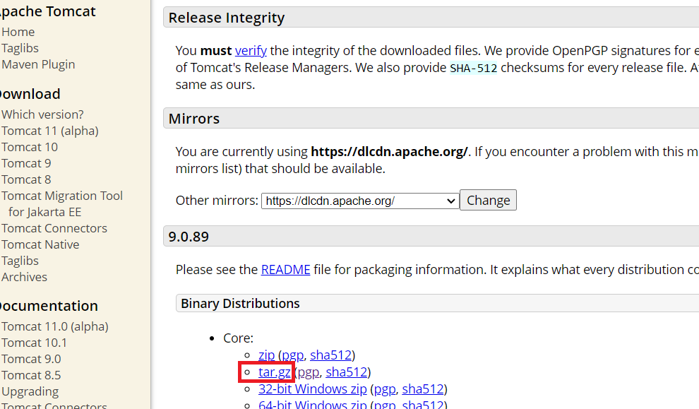
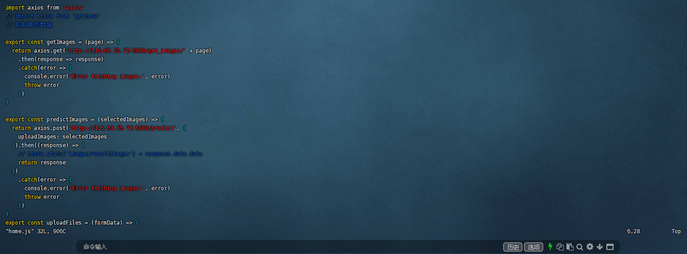

# 重庆大学毕业设计DETR道路交通标志牌检测系统后端

😋😋😋hi~朋友们好，我是一名重庆大学20级计算机科学与技术的普通学生，平时作业全部水过去，临近毕业，突然感觉还是不能太水，于是为了能够顺利毕业，熬夜coding做了一个呃......勉强还能用的系统，这里主要介绍部署流程，希望对还没有掌握网站部署方法的小伙伴有那么一丢丢帮助，如果觉得有，那么请给个免费的star！

***

## 部署流程

### 购买服务器

首先是购买**服务器**，点击[链接](https://console.huaweicloud.com/ecm/?agencyId=3623114d2373476192db4ee43831b29d&region=cn-north-4&locale=zh-cn#/ecs/createVm)进入服务器选择列表(当然，可以不用华为云，像阿里云腾讯云都是很不错的)

首先区域是**随便选**的，最好选国内，我这里选择的是“北京四”

然后是**计费模式**，这里注意，**一定要选按需计费！一定要选按需计费！一定要选按需计费！**重要的话说三遍！不然第二天你就会知道什么叫做花钱如流水！

可用区随便选

然后点击**规格类型选型**，其中vCPUs选择4vCPUs，内存8GB，然后下面的实例类型就随便选一个就行了

然后镜像选择公共镜像里面的Ubuntu20.04版本

然后系统盘选择超高IO

==点击下一步==

网络的话直接使用vpc-default，没有的话看官方提示，它会让你创建一个

不启用源/目的检查

安全组直接创建一个，名字随便起，入方向规则全勾

线路选择静态BGP

然后是公网带宽，这里注意，**选择按流量计费！公网带宽选择按流量计费！公网带宽选择按流量计费！**重要的话说三遍！不然第二天你就会知道什么叫做花钱如流水！

带宽选择100就可以了

然后是释放行为，这里注意，**选择随实例释放！选择随实例释放！选择随实例释放！**重要的话说三遍！不然在你释放实例后忘了释放公网ip的话，第二个月你就会知道什么叫做花钱如流水！

==点击下一步==

设置好名字和密码

==点击下一步==

最后配置如图



立即购买！over！

### 配置服务器环境

用ssh登录服务器，这里推荐final shell，一个很好用的ssh软件

首先更新apt

```bash
apt update
```

首先我们配置好python环境，而管理python环境的一个软件就是Annaconda，因此，我们先安装Annaconda(这里我写错了，其实是annaconda，不过将错就错吧，名字不重要)，而我们要明确一个东西，安装一个软件最好的地方就是官网，千万不要一遇到什么问题就去CSDN查，首先去[官网](https://docs.anaconda.com/free/anaconda/install/linux/)查，那样最有效率。

进入一个合适的位置，安装软件一定要做好分区管理，不要全部都放在一个地方

```bash
cd /home
mkdir annaconda
cd annaconda
```

首先执行下载命令，其中版本号在[这里](https://repo.anaconda.com/archive/)看，这里下载大概需要一分钟的时间，取决于你刚才选择的带宽的大小。

```bash
curl -O https://repo.anaconda.com/archive/Anaconda3-2024.02-1-Linux-x86_64.sh
```

下载完成后，当前目录下就会多一个Anaconda3-2024.02-1-Linux-x86_64.sh这个文件，sh文件就相当于Windows里面的exe文件，可以直接被操作系统加载执行的文件。接着执行

```bash
bash ./Anaconda3-2024.02-1-Linux-x86_64.sh
```

它会然你确认，点击回车即可，然后让你读一些license，你就一直空格，然后最后会让你确认，你就输入yes回车就行。然后是让你选择安装目录，输入以下然后回车，这会在home下创建一个新的目录，然后把必要的文件写进去。

```bash
/home/annaconda3
```

完成上面后，会让你选择是否打开shell后直接进入conda环境，这里要选择”是“，也就是要输入yes，因为如果你不选，那么你后面每次打开shell都会需要输入以下命令`source /home/anaconda3/bin/activate`，这样会很烦很烦，所以yes。OK安装完成，关闭shell再重新打开，你就会看到前面有一个(base)了，意思是现在是默认的conda环境，我们最好自己再创一个属于这个项目的环境，姑且叫它detr吧，请亲执行以下命令，谢谢！

```bash
conda create --name detr python=3.9
```

然后我们激活刚才创建好的环境

```bash
conda activate detr
```

接下来，我们要安装一个中间件了，那就是Minio，这个用来存放我们的图片的，首先进入[官网](https://min.io/download?license=agpl&platform=linux),我们选择Linux版本，amd64架构，因为我们选择的时候就是x86-64，实在不放心的话，可以执行`uname -m`查看到底是不是x86_64的，如果是aarch64，那就是arm架构。

接下来我们选择要下载的包的版本，有三个，分别是binary、rpm、deb，其中binary是可以用于所有的发行版本，rpm只能用于red hat版本，而最后的deb可以用于Ubuntu以及debian版本，我们最好选择deb版本，因为binary的版本需要手动解决依赖问题，简单来说，选怎deb版本就是已经把程序注册到$PATH里面的，你在任何一个地方都可以直接使用这个程序

```bash
mkdir minio
```

```bash
cd minio
```

```bash
wget https://dl.min.io/server/minio/release/linux-amd64/minio_20240510014138.0.0_amd64.deb
```

```bash
dpkg -i minio_20240510014138.0.0_amd64.deb
```

接下来后台启动minio同时设置用户名和密码，这里后台启动的原因是，如果前台启动，你电脑关了，那么shell就关了，那么这个在服务器上运行的程序就没有输出的地方了，于是只能停止，但是你后台启动，你给它指定了一个输出日志和报错信息的地方minio.log，那么即使你的ssh程序关了，它依然在运行。并且这里是先设置环境变量，再运行，而minio会自动从环境变量中获取用户名和密码

```bash
nohup env MINIO_ROOT_USER=admin MINIO_ROOT_PASSWORD=password minio server --console-address ":9001" /mnt/data > minio.log 2>&1 &
```

然后，为了让外面的人能够访问这个minio，我们需要在华为云上打开两个端口，9000以及9001，注意，是入方向规则，然后源地址写`0.0.0.0/0`,这个意思是所有的ip，因为其子网掩码为0，那么对任何的ip的位与运算都是0，等于0.0.0.0所以所有的ip都能访问,其中，9001是给游览器访问的端口，而9000是一个网络api端口，给程序访问的。



ok，接下来我们要拉取代码了，但是拉取代码之前我们要安装git

```bash
sudo apt install git-all
```

返回到home创建一个我们的项目文件夹

```bash
cd ..
mkdir detr
cd detr
```

拉取代码

```bash
git clone https://gitee.com/StevenDongyu/bysj_backend_deployment.git
```

进入代码

```bash
cd  bysj_backend_deployment
```

下载requirements.txt的依赖，这个install是一个下载脚本，功能是先从conda下载，如果下载不了再从pip下载，并且还用的是清华源，下载速度简直

```bash
bash ./install.sh
```

安装完毕后，我们要先准备一下minio的东西，在游览器上输入该服务器的ip加上冒号加上9001进入minio的游览器客户端，首先创建两个bucket。命名为imagebucket和resultbucket，然后进入到obejctBrowser，选择imagebucket，create a new path，输入test2017,然后把我们的图片库的图片传上去，如下



接下来我们要获取这个minio的accessKey以及secretKey，点击Access Keys，在其中创建一个key，最好把它下载下来



然后我们修改一下flask代码，把框出来的ip地址和key都换成自己的

```bash
cd /home/detr/bysj_backend_deployment
vim flaskServer.py
```



这里插一个常用命令，当你想停掉某个服务的时候，先查询到它的pid

```bash
ps aux | grep flaskServer.py
```



然后再kill，至于下面那个数字其实不是我们要找的服务，它之所以有flaskServer.py这个关键字就是因为我们刚才输入了`ps aux | grep flaskServer.py`,这其实就是当前的shell进程，**awsome!**

```bash
kill 122079
```

然后我们尝试运行一下这个后端，在运行之前，要先获取模型，在[这里](https://pan.baidu.com/s/1nDjOa7Pa3ieNVMzXquYrZQ 
提取码：1234),提取码1234，把pt文件放到与flaskServer.py同级目录下即可

```bash
nohup python flaskServer.py > flaskServer.log 2>&1 &
```

查看flaskServer.log发现开放的端口是5000，所以我们再去华为云打开一下5000端口,这里不再演示

好了，现在后端已经全部部署完毕，你可以用postman去测试一下

### 前端部署

接下来是最后一个模块，把前端项目部署上去

```bash
cd ../..
```

首先我们要明确一些步骤，首先前端的代码经过打包后就三种文件，html,css,javascript，然后就是其他的一些资源文件，比如图片什么的。接下来要把这些代码部署到一个容器里面去，那就是tomcat，因此我们首先要下载tomcat。

首先前往[tomcat官网](https://tomcat.apache.org/download-90.cgi),右键复制这个文件的链接



然后用curl下载

```bash
curl -O https://dlcdn.apache.org/tomcat/tomcat-9/v9.0.89/bin/apache-tomcat-9.0.89.tar.gz
```

解压

```bash
tar -xzf apache-tomcat-9.0.89.tar.gz
```

这里注意要更改一下文件名字，方便

```bash
mv apache-tomcat-9.0.89 tomcat
cd tomcat
```

在启动tomcat之前我们要先配置一下Java环境，原因是tomcat是一个servlet容器，而servlet是由Java编写的，所以tomcat需要Java

```bash
sudo apt install openjdk-11-jdk
```

由于我们要配置JAVA_HOME环境变量，所以我们就要知道Java的安装位置，其中，/usr/bin/java是Java可执行文件的符号链接文件的位置，也就是说，apt在安装Java的时候，就会给Java创建一个符号链接(符号链接其实就是相当于Windows里面的快捷方式而已)，并把这个符号链接放到/usr/bin目录下了，为什么要放到这个目录下呢，因为这个目录是大多数可执行文件的符号链接的存放的位置，其目录已经被加到PATH环境变量中了，所以你在shell就可以直接执行里面的文件，因为shell会自动帮你查找。

```bash
readlink -f /usr/bin/java | sed "s:bin/java::"
```

得到安装路径后，打开shell配置文件添加到最后的位置

```bash
vim ~/.bashrc
```

> export JAVA_HOME=/usr/lib/jvm/java-11-openjdk-amd64/
>
> export PATH=\$JAVA_HOME/bin:\$PATH

然后激活我们修改后的环境变量

```bash
source ~/.bashrc
```

然后我们直接进入bin目录先把tomcat拉起来，因为它是热部署的，你再webapps里面的任何更改都会立刻反应到内存中，什么是热部署，tomcat会有一个后台线程定时去检查文件里面有无更改，有的话就会立刻重新加载文件的数据到内存

```bash
nohup ./startup.sh
```

OK，tomcat我们已经部署完毕，接下来是去拉取前端代码，更改一下源代码里面后端服务器的地址，然后把前端代码打包后放到webapps目录下即可，很简单

```bash
cd /home
mkdir frontEndCode
cd frontEndCode
git clone https://github.com/stevenzhangdongyu/bysjFrontEndCode.git
```

接下来我们安装nodejs

```bash
curl -fsSL https://deb.nodesource.com/setup_lts.x | sudo -E bash -
sudo apt-get install -y nodejs
```

执行依赖安装命令，这个命令会读取vue工程下的package.json文件，安装所有需要的库，并且会在当前文件夹下创建一个新的文件夹，用来放刚才下好的库

```bash
npm install--legacy-peer-deps
```

接下来修改代码

```bash
cd src/api
vim home.js
```



然后把里面的ip全部换成本机的ip，输入i进入insert模式，改好后按esc键后输入:wq回车 返回，然后就可以把整个项目打包了

```bash
cd ../..
npm run build
```

然后当前目录下面就会产生一个dist包我们把这个dist重命名然后移动到tomcat的webapp下即可

```bash
 mv ./dist /home/tomcat/tomcat/webapps
 cd /home/tomcat/tomcat/webapps
 mv dist detr
```

接下来就可以在游览器访问了，有人可能会问，你没有开放端口啊，问的好，但是其实我在创建服务器的时候已经把所有常见的端口开放了，其中就包括8080

OK全部大功告成，快去试试吧！


